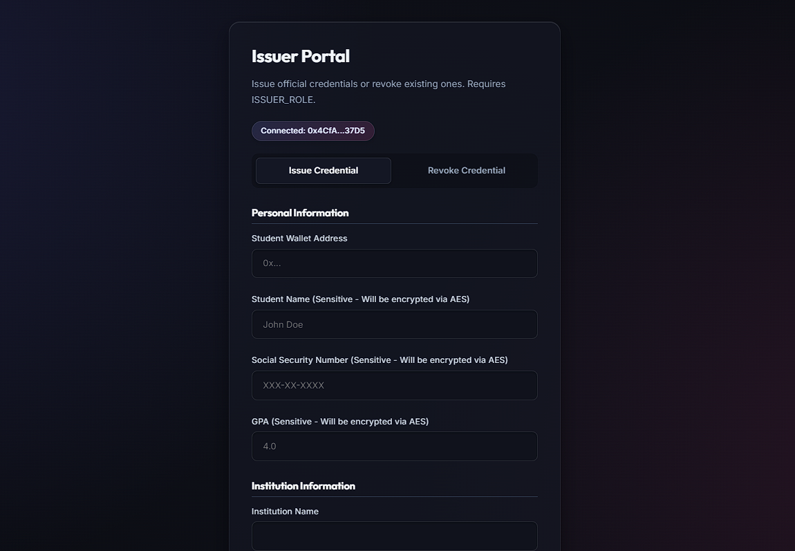
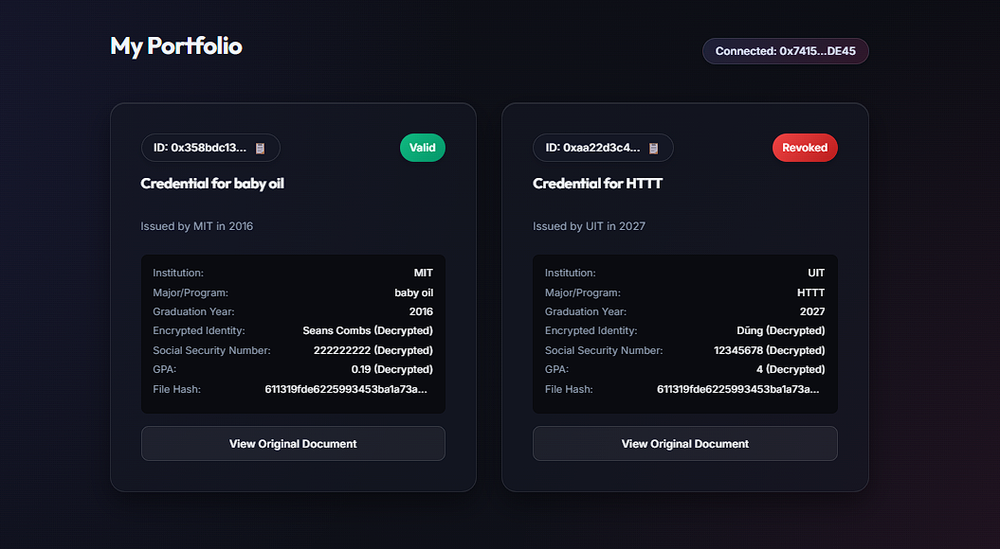
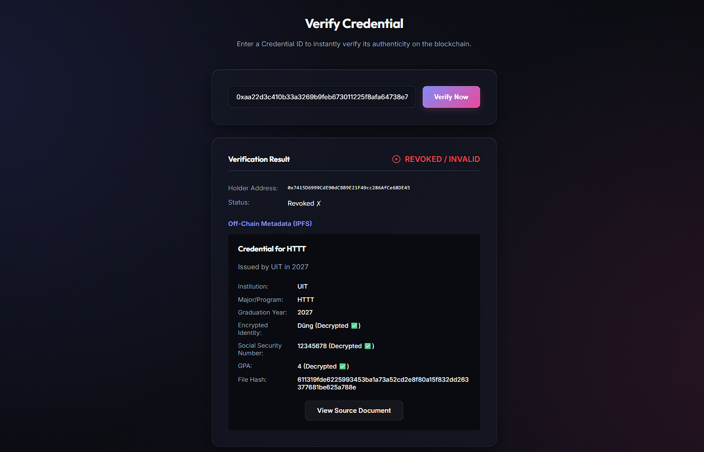

# TrustChain: Blockchain-Based Credential Verification System


TrustChain is a decentralized application (dApp) designed to allow educational institutions and enterprises to securely issue, manage, and instantly verify digital credentials. By leveraging Ethereum Soulbound Tokens (SBTs) and decentralized IPFS storage, TrustChain eliminates third-party background checks and completely prevents credential fraud.

---

## 🎥 Demo Video

[▶️ **Watch the full TrustChain Demonstration Video Here**](https://drive.google.com/file/d/1OrJIvViV7CWvtL5OYZJ5okVORI8cQ5sj/view?usp=sharing)

---

## 🚀 Key Features

*   **Soulbound Tokens (SBTs):** Credentials are non-transferable ERC-721 tokens. Once issued to a student's wallet, they belong to them forever and cannot be sold or traded.
*   **Role-Based Access Control (RBAC):** Only authorized addresses (e.g., Universities, HR Departments) designated with the `ISSUER_ROLE` can mint or revoke credentials.
*   **Decentralized Storage:** Document files (PDFs, images) and metadata schemas are permanently pinned to IPFS via Pinata.
*   **AES-GCM Data Privacy:** Sensitive Personally Identifiable Information (PII) such as SSNs and GPA are AES-encrypted off-chain before IPFS upload, ensuring public data privacy.
*   **Permanent Revocation:** Issuers can permanently flag a credential as revoked for policy violations, instantly updating its status across the blockchain.

---

## 🏗️ System Architecture


1.  **Frontend Interface:** Built with Next.js and Ethers.js for Web3 wallet interactions.
2.  **Smart Contracts:** Solidity contracts managed and tested via Hardhat.
3.  **Storage Layer:** IPFS / Pinata for off-chain document storage.
4.  **Network:** Compatible with Localhost (Hardhat), Sepolia Testnet, or Ethereum Mainnet.

---

## 🖥️ Portals Overview

### 1. The Issuer Portal

*Designed exclusively for administrators.*
*   Connect with an `ISSUER_ROLE` wallet.
*   Input student details, encrypt sensitive data, and upload diploma files.
*   Mint new SBT credentials or Permanently Revoke existing ones.

### 2. The Student Portfolio

*Designed for end-users and graduates.*
*   Connect personal MetaMask wallet.
*   View all earned Soulbound credentials, decrypt personal data, and access original IPFS documents.

### 3. The Verifier Tool

*Designed for employers and third-party verifiers.*
*   Publicly accessible portal.
*   Input a Credential ID to instantly ping the blockchain and verify its authenticity and current revocation status.

---

## 🛠️ Getting Started

### Prerequisites
*   [Node.js](https://nodejs.org/) (v18+)
*   [MetaMask](https://metamask.io/) Extension installed in your browser.
*   A [Pinata](https://pinata.cloud/) API Key (JWT).

### 1. Clone & Install
```bash
# Install Smart Contract dependencies
cd smart-contracts
npm install

# Install Frontend dependencies
cd ../frontend
npm install
```

### 2. Environment Setup
In the `frontend` directory, create a `.env.local` file:
```env
PINATA_JWT="your_pinata_jwt_token_here"
```

### 3. Run the Local Blockchain & Deploy
Open a terminal and start the Hardhat node:
```bash
cd smart-contracts
npx hardhat node
```
Open a **second** terminal and deploy the smart contract to the local node:
```bash
cd smart-contracts
npx hardhat run scripts/deploy.js --network localhost
```
*Note the deployed contract address and update `CONTRACT_ADDRESS` in your frontend configuration if necessary.*

### 4. Start the Frontend Application
Open a **third** terminal:
```bash
cd frontend
npm run dev
```
Navigate to `http://localhost:3000` in your browser.

---

## 🔑 Managing Multiple Issuers (RBAC)

Because TrustChain uses OpenZeppelin's `AccessControl`, the **Deployer** of the smart contract holds the `DEFAULT_ADMIN_ROLE`. 

The Admin can grant the `ISSUER_ROLE` to multiple universities, HR departments, or specific administrative wallets.

To add a new issuer via a Hardhat script:
```javascript
const contract = await ethers.getContractAt("CredentialSBT", "YOUR_CONTRACT_ADDRESS");
const ISSUER_ROLE = await contract.ISSUER_ROLE();

// The deployer calls grantRole
await contract.grantRole(ISSUER_ROLE, "0xNewIssuerWalletAddressHere");
console.log("New issuer added successfully!");
```
Once granted, the new wallet address will instantly bypass the `onlyIssuer` modifier and have full access to the **Issuer Portal**.

---

## 🛡️ Security & Privacy
*   **Do NOT** expose your `PINATA_JWT` in the browser. API calls to Pinata are safely proxied through Next.js server-side API routes (`/api/pinata`).
*   **Encryption Key:** Currently, AES keys are handled locally. For production deployments, implement a secure Key Management System (KMS) or decentralized identity (DID) architecture for key distribution.

---

## 📄 License
This project is licensed under the MIT License.
